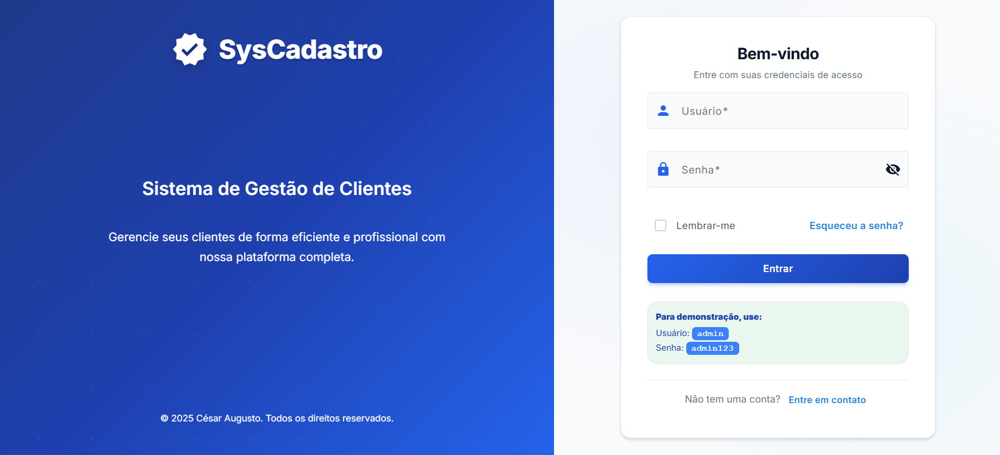
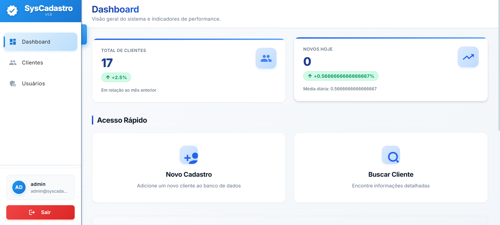
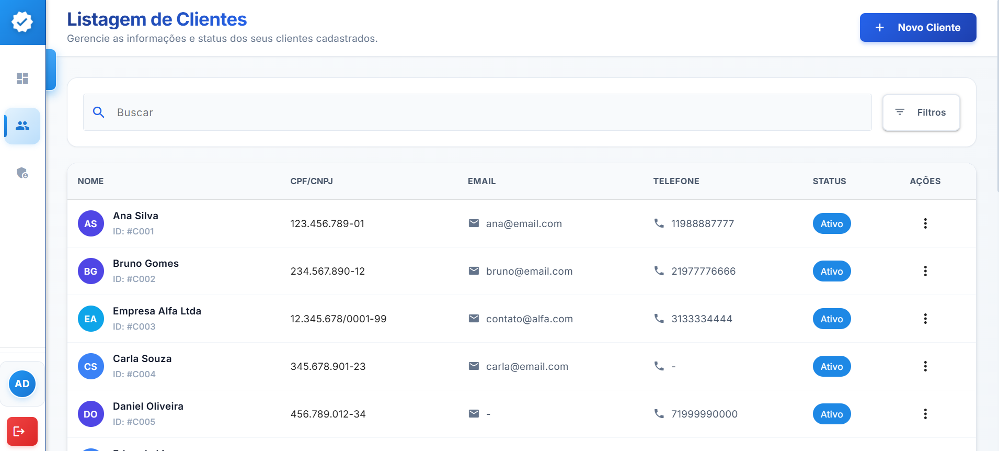
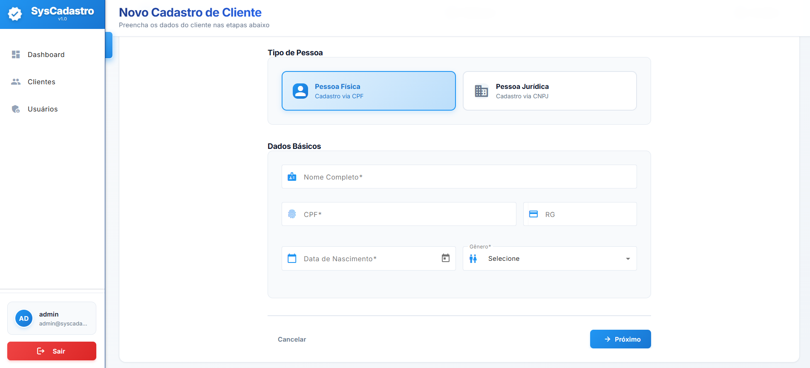

# SysCadastro

Sistema de gestão de clientes desenvolvido com Angular 20 e Spring Boot, oferecendo uma interface moderna e intuitiva para cadastro e gerenciamento de informações de clientes.

## 📸 Screenshots

### Tela de Login


### Dashboard


### Listagem de Clientes


### Cadastro de Cliente


## 🚀 Tecnologias

### Frontend
- **Angular 20.3.0** - Framework principal
- **TypeScript 5.9.2** - Linguagem de programação
- **RxJS 7.8.0** - Programação reativa
- **JWT Decode 4.0.0** - Decodificação de tokens JWT
- **Lucide Angular 0.562.0** - Ícones

### Backend
- **Spring Boot** - Framework Java
- **Spring Security** - Autenticação e autorização
- **JWT** - Tokens de autenticação
- **PostgreSQL** - Banco de dados

## ✨ Funcionalidades

- ✅ **Autenticação JWT** - Login seguro com tokens
- ✅ **Dashboard Interativo** - Visualização de métricas e clientes recentes
- ✅ **Gestão de Clientes** - CRUD completo com busca e filtros
- ✅ **Cadastro em Abas** - Interface intuitiva dividida em:
  - Dados Pessoais
  - Endereços (com busca automática por CEP)
  - Contatos
- ✅ **Suporte a Pessoa Física e Jurídica**
- ✅ **Máscaras de Input** - CPF, CNPJ, CEP, Telefone
- ✅ **Design Responsivo** - Funciona em desktop, tablet e mobile
- ✅ **Sidebar Colapsável** - Otimização de espaço em tela

## 🔐 Credenciais de Demonstração

Para testar o sistema, utilize:

- **Usuário:** `admin`
- **Senha:** `admin123`

## 📁 Estrutura do Projeto

```
syscadastro/
├── src/
│   ├── app/
│   │   ├── components/        # Componentes reutilizáveis
│   │   ├── pages/            # Páginas da aplicação
│   │   ├── services/         # Serviços e comunicação com API
│   │   ├── models/           # Interfaces e tipos
│   │   ├── enums/            # Enumerações
│   │   ├── guards/           # Guards de roteamento
│   │   ├── interceptors/     # Interceptors HTTP
│   │   └── layout/           # Componentes de layout
│   ├── environments/         # Configurações de ambiente
│   └── assets/              # Recursos estáticos
└── backend/                 # Código Spring Boot
```

## 🎨 Componentes Principais

### Pages
- **Login** - Autenticação de usuários
- **Dashboard** - Visão geral com métricas
- **Clientes** - Listagem com busca e filtros
- **Cadastro** - Formulário em abas para cadastro/edição

### Components
- **Avatar** - Exibição de iniciais do usuário
- **Status Badge** - Badge de status do cliente
- **Stats Card** - Cartões de estatísticas
- **Recent Clients Table** - Tabela de clientes recentes

### Layout
- **Sidebar** - Menu lateral navegável
- **Header** - Cabeçalho das páginas

## 🔒 Segurança

- Autenticação via JWT
- Interceptor automático para adicionar token nas requisições
- Guard de rotas para proteger páginas privadas
- Validação de token expirado

## 🌐 API Endpoints

### Autenticação
- `POST /auth/login` - Login de usuário

### Clientes
- `GET /cliente` - Listar todos os clientes
- `GET /cliente/{id}` - Buscar cliente por ID
- `POST /cliente` - Criar novo cliente
- `PUT /cliente/{id}` - Atualizar cliente
- `DELETE /cliente/{id}` - Deletar cliente
- `GET /cliente/metricas` - Obter métricas do dashboard
- `GET /cliente/recentes` - Obter clientes recentes

## 🤝 Contribuindo

Contribuições são bem-vindas! Sinta-se à vontade para abrir issues ou pull requests.

1. Fork o projeto
2. Crie sua feature branch (`git checkout -b feature/AmazingFeature`)
3. Commit suas mudanças (`git commit -m 'Add some AmazingFeature'`)
4. Push para a branch (`git push origin feature/AmazingFeature`)
5. Abra um Pull Request